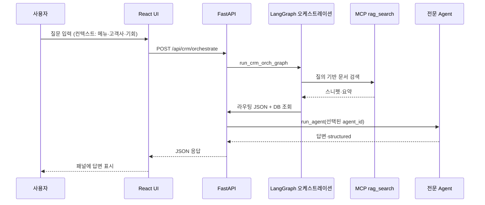

# **서비스명 — AI 영업관리 포탈**

*예시 형식: AI Tech. Trend Agent – 홍길동 → 본 과제: **AI 영업관리 포탈** – (작성자명 기입)*

---

## **1. 프로젝트 개요 – 기획 배경 및 핵심 내용**

### **1.1 프로젝트 기획 배경**

- **어떤 문제를 해결하고자 하는가?**  
  영업 담당자가 고객사·사업기회별로 활동(메일, 회의록, 의견)을 남기고, 수주 가능성과 다음 액션을 판단할 때 정보가 분산되어 있고 정리·검색에 시간이 많이 든다. 본 서비스는 **잠재고객·사업기회·영업활동을 한 포탈에 모으고**, 질의에 대해 **맥락 있는 답변·전략·Action item**을 제공하는 것을 목표로 한다.

- **기존 방식의 한계는 무엇인가?**  
  스프레드시트·메일함·개인 메모에 흩어진 기록, 고객사/기회와 활동의 **수동 연결**, 과거 이력을 찾기 어려운 검색, 수주확률·단계별 할 일에 대한 **일관된 기준 부재**.

- **Agent 서비스로 해결할 수 있는 Pain Point는 무엇인가?**  
  자연어 질의에 대해 **선택된 고객사·사업기회 컨텍스트**와 **RAG로 보강된 지식**을 합쳐 요약·추천을 생성하고, 질문 유형에 따라 **전문 에이전트**로 라우팅하여 응답 품질과 일관성을 높인다. 활동 본문 기반 **고객사·기회 매핑 제안**으로 입력 부담을 줄인다.

- **이 프로젝트를 시작하게 된 동기는 무엇인가?**  
  Bootcamp에서 학습한 **Prompt 설계, LangGraph, RAG, FastAPI, MCP**를 **실무형 End-to-End Agent 서비스**로 묶어, 영업 도메인에서 바로 체감할 수 있는 UX를 만들고자 함.

### **1.2 핵심 아이디어 및 가치 제안 (Value Proposition)**

- **서비스가 제공하는 핵심 기능은 무엇인가?**  
  고객사·사업기회·영업담당 **CRUD**, 활동 등록(텍스트·첨부), **AI 영업관리 Agent**(오케스트레이션)를 통한 질의 응답, **MCP RAG** 기반 문서 검색 맥락 보강, 사업기회별 **수주확률(규칙 기반)**·**단계별 Action item** 시드.

- **사용자에게 제공되는 가치와 기대효과는 무엇인가?**  
  화면에서 고객사/기회를 고른 상태로 질문하면 **의도에 맞는 전문 에이전트**가 동작하고, RAG로 내부 문서 요지를 반영할 수 있다. 활동·기회 데이터가 구조화되어 **이력 추적·우선순위 판단**에 활용 가능하다.

- **기존 서비스 대비 차별성은 무엇인가?**  
  단일 챗봇이 아니라 **오케스트레이터 + 다수 전문 Agent + LangGraph 파이프라인(RAG → 라우팅·실행)**으로 역할을 나누고, **공공·DART 참고 시드 고객사**와 **IT/SI 성격 사업기회**로 데모 시나리오를 구체화함.

### **1.3 대상 사용자 및 기대 사용자 경험 (UX)**

- **주요 타겟**  
  **영업 실무자**(고객사·기회 담당), **팀장·관리자**(담당자 배정·현황 파악). (확장 시) 세일즈옵스·마케팅 협업 역할.

- **사용자에게 어떤 흐름과 경험을 제공할 것인가?**  
  좌측 네비에서 **고객사 / 사업기회 / 영업담당 / 활동등록**을 오가며 데이터를 보고, 우측 **AI 영업관리 Agent** 패널에 질문을 입력한다. 현재 선택한 메뉴·고객사·기회 id가 **컨텍스트**로 전달되어 답변이 맞춤화된다.

- **사용자가 서비스에서 얻는 구체적 Benefit은 무엇인가?**  
  한 화면에서 **계정·기회·활동**을 연결해 보고, AI가 **고객사 요약, 기회 상세, 수주확률 설명, 활동 매핑·추천** 등 역할별로 응답한다. RAG로 사내 문서를 넣어 두면 **질의와 연관된 스니펫**이 응답 맥락에 반영될 수 있다.

---

## **2. 기술 구성 – 서비스에 적용할 기술 스택**

### **2.1 Prompt Engineering 전략**

- **역할 기반 프롬프트**  
  오케스트레이션 시스템 프롬프트(`ORCH_SYSTEM`)에서 **AI 영업관리 포탈의 오케스트레이터** 역할을 명시하고, 전문 에이전트별(`company_info`, `opportunity_info`, `activity_mapping` 등)로 **담당 업무와 금지 사항(추측 금지 등)**을 정의한다.

- **CoT / Few-shot 등 고품질 응답 전략**  
  오케스트레이터에 **내부 추론 순서**(질문 의도를 한 줄로 정리한 뒤 에이전트·ID 선택)를 프롬프트에 포함한다.

- **출력 구조화 템플릿 정의**  
  라우팅 단계에서는 LLM이 **JSON 한 덩어리**만 출력하도록 강제(`agent_id`, `company_id`, `opportunity_id`, `rationale_ko` 등). 파싱 실패 시 **휴리스틱 라우팅**으로 폴백한다.

- **사용자 유형/상황별 프롬프트 분기**  
  **현재 메뉴**, **화면에서 선택된 고객사/기회 id**, **MCP RAG 요약 블록**을 사용자 메시지 상단에 붙여 **맥락 기반 분기**를 돕는다.

### **2.2 LangChain / LangGraph 기반 Agent 구조**

- **Multi-Agent 설계 개념**  
  **단일 Agent만으로는 부족**하다는 과제 가이드를 반영하여, **오케스트레이터 1 + 전문 에이전트 N** 구조를 취한다. CRM 질의는 **LangGraph**로 **노드 1: MCP RAG 검색 → 노드 2: 라우팅·전문 에이전트 실행** 순으로 구성한다. (`rag_agent/crm/langgraph_orch.py`)

- **각 Agent의 역할 (Role) 정의**  
  예: `company_info`(고객사·소속 기회·활동 요약), `opportunity_info`(기회 단위 상세), `win_probability`(수주확률 근거 설명), `activity_mapping`(본문→고객사·기회 매핑), `activity_recommendation`(다음 액션·단계 추천), `opp_rep_mapping`(기회–담당 정합성) 등.

- **Tool Calling, ReAct, Memory 활용 여부**  
  **MCP**를 통해 `rag_search`, `rag_ingest`, `rag_stats` 등 **도구 호출**에 해당하는 연동을 수행한다. CRM 경로에서는 **명시적 그래프 노드**로 RAG와 실행을 분리한다. 세션 **장기 Memory**는 본 MVP 범위에서 최소화하고, **DB에 적재된 활동·기회**가 사실상의 맥락 메모리 역할을 한다. (RAG 일반 채팅 파이프라인은 별도 오케스트레이터 모듈에 존재.)

### **2.3 RAG 구성**

- **데이터 수집/전처리 파이프라인**  
  API `POST /api/ingest` 등으로 문서를 넘기면 MCP `rag_ingest`가 **청킹·임베딩·저장**을 담당한다. 활동 등록 시 **office/eml/txt 등 첨부**에서 텍스트 추출 후 저장·매핑 제안에 활용한다.

- **임베딩 모델 및 Vector DB 선택**  
  **ChromaDB** 로컬(또는 설정 경로) 저장, 임베딩은 **Azure OpenAI / OpenAI 호환** 설정에 따라 선택 가능하도록 구성(`docs/env/ai-models.md` 참고).

- **검색 로직과 응답 생성 방식**  
  MCP `rag_search`로 상위 스니펫을 가져와 오케스트레이션 **사용자 블록**에 `[MCP RAG 검색 요약]`으로 삽입한 뒤, 라우팅된 전문 에이전트가 LLM으로 최종 답변을 생성한다.

### **2.4 서비스 개발 및 패키징 계획**

- **UI 개발 방식**  
  **Vite + React** (`frontend/`), 브랜드명 **AI 영업관리 포탈**, API는 프록시 또는 `VITE_API_BASE`로 백엔드와 통신.

- **BE(API) 및 배포 전략**  
  **FastAPI** (`rag_agent/api/main.py`), Uvicorn 실행. 선택적으로 루트 **Dockerfile**로 백엔드 컨테이너화.

- **설정/환경 관리 계획**  
  **`.env`** + `python-dotenv`, `AOAI_*` / `OPENAI_*` / `CHROMA_PATH` / `CRM_REBUILD_SEED` / `AICRM_DB_PATH` 등. 예시는 `.env.example`, 상세는 `docs/env/` 참고.

### **2.5 선택적 확장 기능**

- **LLM Fundamentals 기반 Structured Output / Function Calling**  
  오케스트레이터의 **JSON 라우팅 출력**이 구조화 응답에 해당한다.

- **MCP 기반 파일·시스템·API 연동**  
  `mcp_servers/` RAG DB 서버와 클라이언트 호출로 **문서 DB 도구**를 붙였다.

- **A2A 기반 Agent 협업 구조**  
  오케스트레이터가 **전문 에이전트를 선택·위임**하는 방식으로 Agent-to-Agent에 준하는 협업을 구현한다.

---

## **3. 주요 기능 및 동작 시나리오**

### **3.1 사용자 시나리오 (Use Case Scenario)**

| 단계 | 사용자 목표 | 행동 |
|------|-------------|------|
| 1 | 담당 고객사 파악 | 고객사 목록에서 회사 선택, 상세·연결 사업기회·활동 확인 |
| 2 | 기회 추적 | 사업기회 화면에서 단계·수주확률·활동 확인 |
| 3 | 활동 기록 | 활동등록에서 메일/회의록/의견·첨부 입력, 고객사·기회 지정 또는 매핑 제안 활용 |
| 4 | AI 질의 | 우측 패널에 “이 고객사 관련 최근 이슈 요약”, “이 기회 다음 액션 추천” 등 입력 |
| 5 | 담당·계정 관리 | 영업담당 메뉴에서 담당자 추가/삭제 및 고객사·기회 배정 조정 |

### **3.2 시스템 구조도 / Multi-Agent 다이어그램**

*제출 시 스크린샷 또는 도구로보낸 이미지를 여기에 첨부할 수 있습니다. 아래는 동일 내용의 Mermaid 다이어그램 예시입니다.*

```mermaid
flowchart TB
  subgraph UI["프론트엔드 (React)"]
    WEB[AI 영업관리 포탈 UI]
  end
  subgraph API["FastAPI"]
    CRM[/api/crm/*]
    RAG_API[/api/chat, /api/ingest ...]
  end
  subgraph CRM_CORE["CRM 도메인"]
    DB[(SQLite aicrm.db)]
    ORCH[LangGraph: RAG 노드 → 라우팅·실행 노드]
    AGENTS[전문 Agents 레지스트리]
  end
  subgraph MCP["MCP"]
    RAGMCP[rag_db 서버]
    CHROMA[(Chroma)]
  end
  WEB --> CRM
  WEB --> RAG_API
  CRM --> DB
  CRM --> ORCH
  ORCH --> AGENTS
  ORCH --> RAGMCP
  RAGMCP --> CHROMA
```

**Add image** *(제출물: 위 다이어그램을 이미지로 캡처하여 삽입)*

### **3.3 서비스 플로우 (Flow Chart / Sequence Diagram 등)**

*사용자 요청 → Agent 처리 → RAG 검색 → 응답 생성 → UI 출력*



**Add image** *(제출물: 시퀀스/플로우 이미지 첨부)*

---

## **4. 실행 결과**

*서비스 개발 IDE 내 소스 실행 결과를 아래에 기술·첨부합니다.*

- **서비스 실행 결과 (text)**  
  - 백엔드: `uvicorn rag_agent.api.main:app --reload --host 127.0.0.1 --port 8000`  
  - 프론트: `cd frontend && npm run dev`  
  - 기동 후 브라우저에서 고객사 선택 → 우측 AI 패널에 질문 입력 → 라우팅 이유·답변이 표시되는지 확인.  
  - *(실행 로그·응답 JSON 일부를 여기에 붙여 넣기)*

- **데모 이미지 or 영상 등**  
  - *(스크린샷: 고객사 상세 + AI 패널, 사업기회·수주확률 화면 등)*  

**Add image**

**Add video**

---

## **5. 추가 아이디어 (선택)**

- **데이터 품질**: data.go.kr·DART **Open API 자동 동기화**로 고객사 마스터 갱신, `dart_profile` 필드 실시간 반영.  
- **타겟 분류**: 산업·규모·기회 단계별 **라우팅 규칙·프롬프트 프리셋** 고도화.  
- **성능**: RAG 검색 **캐시**, 오케스트레이션 **스트리밍 응답(SSE)** CRM 패널 연동.  
- **알림**: 일정·Action item 마감 **이메일/슬랙** 웹훅.  
- **UX**: Agent 답변의 **인용 활동 id·문서 출처** 하이라이트, 다크 모드·모바일 레이아웃.  
- **Memory**: 세션 단위 **대화 요약**을 DB에 저장해 멀티턴 질의 품질 개선.

---

## **부록: 관련 문서·경로**

| 구분 | 경로 |
|------|------|
| PRD | `docs/prd/AICRM_prd.md` |
| 과제 가이드 대응 | `docs/guides/assignment-alignment.md` |
| 고객사 시드 데이터 | `rag_agent/crm/companies_data.py` |
| LangGraph CRM | `rag_agent/crm/langgraph_orch.py` |
